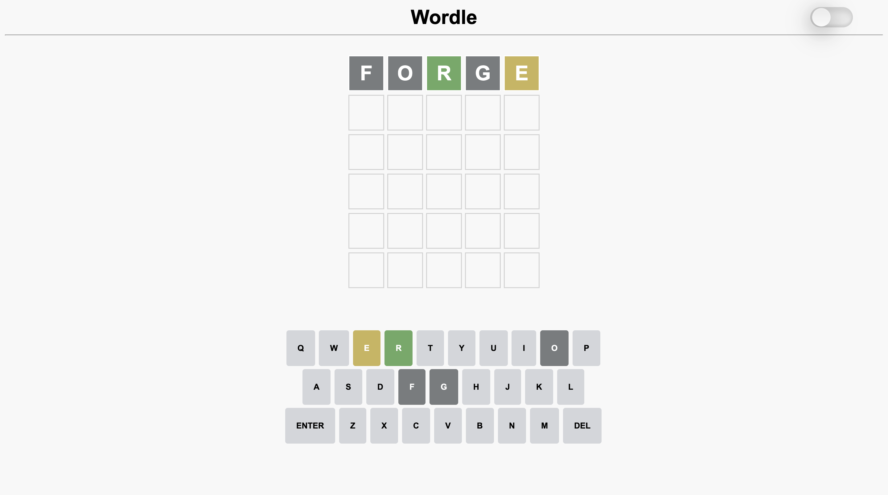
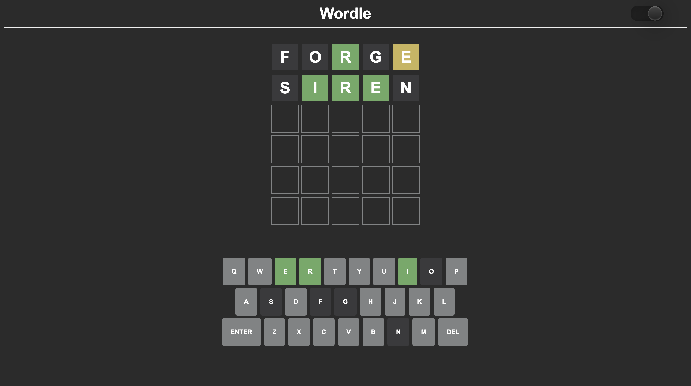

# Wordle

### A Vanilla JavaScript Implementation of the Classic Wordle Game

This project is a functional clone of the popular online game Wordle, developed using vanilla JavaScript. It mimics the core gameplay mechanics of Wordle, featuring a 5x6 grid where players try to guess the word in 6 tries. Heres the basic flow of game:

### How to Play


Each guess must be a valid 5-letter word. The color of the tiles will change to show how close your guess was to the word:

• green letter would mean it is in correct spot

• yellow letter would mean it is present in word but not in correct spot

• grey letter would mean it is not present in word
## Screenshots




## Features


- Integrated the OpenAI API for dictionary checks.
- Efficiently handles user input and feedback display.
- Minimizes latency and ensures smooth gameplay experience.
- Adapts the game layout for different screen sizes and devices.

## Color Reference

| Color             | Hex                                                                |
| ----------------- | ------------------------------------------------------------------ |
| Background|  #2b2b2b |
| Correct |  #6aaa64 |
| Present |  #c9b458 |
| Absent |  #787C7E |


## Contributions

Contributions are always welcome! Whether you want to improve the documentation, fix bugs, add new features, or simply share your feedback, there are many ways you can contribute to this project.

Here’s how you can contribute:

- Fork the Repository:

   Click on the "Fork" button at the top right corner of this page to create your own copy of the repository.

- Clone Your Fork:

     ```bash
     git clone https://github.com/your-username/your-repo-name.git
     ```

- Create a Branch:

     ```bash
     git checkout -b your-branch-name
     ```

- Make Changes:

   Make your changes or add new features. Be sure to write clear and concise commit messages.

- Commit and Push to fork:

     ```bash
     git add .
     git commit -m "Describe your changes here"
     git push origin your-branch-name
     ```

- Open a Pull Request:

   Go to the original repository and open a pull request. Provide a clear description of the changes and why they should be merged.


If you have any questions or need help, feel free to open an issue or reach out. Totally appreciate your contributions and look forward to working with you!

Happy coding!


## Deployment

**If you're testing locally, you can use a simple HTTP server:**


Install http-server globally 
```bash
  npm install -g http-server
```

Use http-server on project directory
```bash
  npx http-server
```
---

© 2024 amanxshad. 